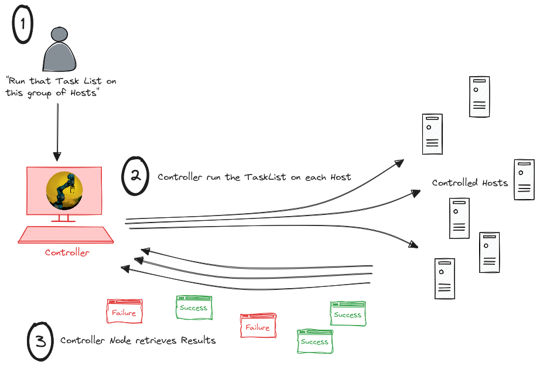

# Dux : automation tools written in Rust
<div align="center">

</div>

# The goal
Instead of having one big automation tool (meaning configuration management or orchestration tool) trying to handle all scenarios (be scalable, performant, handle local and remote hosts through this protocol or this one, be compliant with this security standard and this one...), we prefer to build one flexible automation *engine* (the [duxcore](https://crates.io/crates/duxcore) crate) and make it as easy as possible to embed in a codebase already adapted to one's specific need.

This repository contains 3 proof of concept AKA examples of how the [duxcore](https://crates.io/crates/duxcore) crate can be used :
- scalable version : 3 components (Controller Node / Message Broker / Worker Node)
- standard version : 1 executable which does everything (run TaskList on a Host List)
- agent version : dux installed as a service on a host and regularly enforcing a TaskList which can be a local/remote file or a URL (pointing to a git repository for example)

Other possibilities :
  - use [Apache Kafka](https://kafka.apache.org/) instead of [RabbitMQ](https://www.rabbitmq.com/)
  - use [gRPC](https://grpc.io/) to have controller and worker communicate with one another
  - build an interactive console where you pass module calls ("apt git present"), it's instantly applied to the Hosts list and you directly get the results
  - ...

# Scalable version
<div align="center">

</div>
A worker node can be either a physical/virtual machine or a container. To increase the capacity of the system, just increase the number of worker nodes or their ability to multithread (number of CPU cores basically).

# Standard version
<div align="center">

</div>
Classic use case : a binary running on a Host and reaching out to other Hosts to apply some configuration (AKA Task list)

# Basic usage
With the standard version : ```dux -t <tasklist.yaml> -l <hostlist.yaml> -k <SSH private key> -u <username>```

*with `tasklist.yaml`*
~~~
---
- name: Prerequisites
  steps:
    - name: 1. Test SSH connectivity
      ping:

    - name: 2. Upgrade the whole system
      with_sudo: true
      apt:
        upgrade: true

    - name: 3. Install git
      with_sudo: true
      apt:
        state: present
        package: "{{ packagename }}"
    
    - name: 4. Clean before clone
      command:
        content: rm -rf dux

    - name: 5. Clone a repository
      command:
       content: git clone https://github.com/romzorus/dux.git
~~~
*and `hostlist.yaml`*
~~~
vars:
  packagename: git

hosts:
  - 192.168.1.6
  - 192.168.1.85
~~~
**Output example**

~~~

    ██████╗ ██╗   ██╗██╗  ██╗
    ██╔══██╗██║   ██║╚██╗██╔╝
    ██║  ██║██║   ██║ ╚███╔╝ 
    ██║  ██║██║   ██║ ██╔██╗ 
    ██████╔╝╚██████╔╝██╔╝ ██╗
    ╚═════╝  ╚═════╝ ╚═╝  ╚═╝

Host 192.168.1.6 : Changed
Task : Prerequisites
┌───────────────────────────┬───────────────────────────────────────────────────────────┬────────────────────────────────────┐
│           Step            │                          Changes                          │Results                             │
├───────────────────────────┼───────────────────────────────────────────────────────────┼────────────────────────────────────┤
│1. Test SSH connectivity   │Check SSH connectivity with remote host                    │Success : Host reachable through SSH│
│2. Upgrade the whole system│Upgrade                                                    │Success : APT upgrade successful    │
│3. Install git             │Install - git                                              │Success : git install successful    │
│4. Clean before clone      │Run command : rm -rf dux                                   │Success : Command successfull       │
│5. Clone a repository      │Run command : git clone https://github.com/romzorus/dux.git│Success : Command successfull       │
└───────────────────────────┴───────────────────────────────────────────────────────────┴────────────────────────────────────┘

Host 192.168.1.85 : Changed
Task : Prerequisites
┌───────────────────────────┬───────────────────────────────────────────────────────────┬────────────────────────────────────┐
│           Step            │                          Changes                          │Results                             │
├───────────────────────────┼───────────────────────────────────────────────────────────┼────────────────────────────────────┤
│1. Test SSH connectivity   │Check SSH connectivity with remote host                    │Success : Host reachable through SSH│
│2. Upgrade the whole system│Upgrade                                                    │Success : APT upgrade successful    │
│3. Install git             │Package(s) already in expected state                       │None                                │
│4. Clean before clone      │Run command : rm -rf dux                                   │Success : Command successfull       │
│5. Clone a repository      │Run command : git clone https://github.com/romzorus/dux.git│Success : Command successfull       │
└───────────────────────────┴───────────────────────────────────────────────────────────┴────────────────────────────────────┘
~~~

# Modules available
*(alphabetized)*
| Module | Description |
| ---      | ---      |
| `apt` | Manage packages on Debian-like distributions |
| `command` | Run a single shell command on the controlled host |
| `dnf` | Manage packages on Fedora-like distributions (no difference with `yum`) |
| `lineinfile` | Manipulate lines in a file (add, delete) |
| `ping` | Test SSH connectivity with remote host |
| `yum` | Manage packages on Fedora-like distributions (no difference with `dnf`) |

# Have a remote host handled by Dux

## On controlled host
As for other automation tools, Dux needs an account to use on the controlled host. Let's create a `dux` user on the controlled host and give it some privileges :
```
# Create user (set password interactively)
sudo adduser dux

# Add user to sudo group
sudo usermod -aG sudo dux

# Create a sudoers file for this user
echo "dux ALL = (root) NOPASSWD:ALL" | sudo tee /etc/sudoers.d/dux
```

## On controller host
The ideal is to have a SSH passwordless connection :
```
# Generate a SSH key (no passphrase for the example)
ssh-keygen -t ed25519 -f controller_key -N "" -q

# Have this key allowed on the controlled host
ssh-copy-id -i controller_key.pub dux@<controlled host address>
```

**After this, you can use `dux` like this from the controller node**

```dux -t <tasklist.yaml> -l <hostlist.yaml> -u dux -k <path to controller_key>```

# Contributions

## Want to write a new module ?
Because it can be tricky to integrate a new module in the codebase, a script will do that for you !

*Let's create a `lineinfile` module :*
```
cd lib/taskexec/src/modules
./integrate-new-module.sh lineinfile
```
A `lineinfile.rs` file is created in `lib/taskexec/src/modules`. Now you only have to care about this file. The integration is done. It is a template in which you will find explanations and guidelines. When you are done with this file, just `cargo build` and try using your new module in a TaskList !

## Want to talk about this project ?
Open to suggestions, feedback, requests and any contribution ! Let's talk [here](https://discord.com/invite/2gxAW7uzsx) !

# Todo list
- [x] All: introduce variabilization in TaskLists
- [x] All: introduce configuration files
- [ ] All: optimization (lots of `clone` out there)
- [ ] All: error handling (lots of `unwrap` out there)
- [ ] HostList: introduce aliases and connection mode
- [x] HostList: introduce parameters (per all/group/host)
- [ ] HostList: add JSON format handling
- [ ] TaskExec: modules need to produce a standardized JSON result
- [X] CLI: checks and argument need to be adapted between all-in-one, controller and worker exec
- [ ] RabbitMQ: turn connections parts into a crate
- [ ] RabbitMQ: add resiliency mechanisms (lost connection...etc)
- [ ] All: add unit tests and integration tests
- [ ] Pipeline: add tests
- [ ] Pipeline: remove previous package if run with same version number (overwrite)
- [ ] Worker: create Docker image to allow scaling it
- [ ] Connection: introduce compatibility with [QUIC](https://github.com/quinn-rs/quinn), [SSH3](https://github.com/francoismichel/ssh3), other protocol ?
- [ ] modules to handle Android and IOT devices
- [ ] log generation : what is applied when on what, syslog interaction, ability to generate JSON content (for log aggregators for example)
- [ ] mode pass-on-demand (TaskList applied only when asked) VS watcher (TaskList applied on a regular basis by the Controller/Worker) VS agent (exec with an Assignment embedded in Controlled Host which regularly applies it on localhost)
- [ ] agent version : dux running on a Host as a service, regularly retrieving TaskList from a local file, a remote host or a URL (git repo) and applying it to localhost -> pull mode : the controlled Host are actually the ones that fetch TaskList and apply it to themselves, instead of waiting for a Worker node to take care of them (push)
- [ ] Scalable: introduce end-to-end encryption [(Ockam ?)](https://github.com/build-trust/ockam)
- [ ] Create a gRPC based version

# License
Licensed under the Apache License, Version 2.0 (the "License");
you may not use this file except in compliance with the License.
You may obtain a copy of the License at

[http://www.apache.org/licenses/LICENSE-2.0](http://www.apache.org/licenses/LICENSE-2.0)

Unless required by applicable law or agreed to in writing, software
distributed under the License is distributed on an "AS IS" BASIS,
WITHOUT WARRANTIES OR CONDITIONS OF ANY KIND, either express or implied.
See the License for the specific language governing permissions and
limitations under the License.
